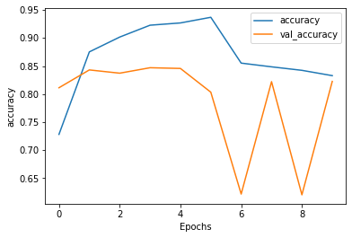
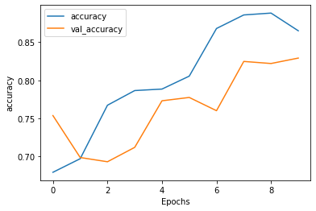
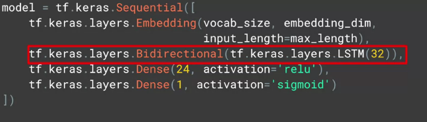
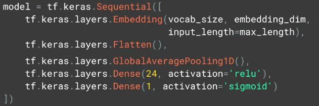
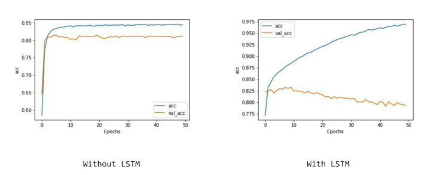

1) Example of RNN: Today has a beautiful _____ --> sky

2) Example of LSTM: I lived in Ireland, so at school they made me learn how to speak _____ --> Galeic   
If we just look sequence of words, we might loose context.

3) Bi-directional: Later contexts can impact earlier ones as well.

4) `tf.keras.layers.LSTM(64)` --> 64 is no of outputs desired from this layer. Now on wrapping this with Bi-directional like `tf.keras.layers.Bidirectional(tf.keras.layers.LSTM(64))` --> output will be 128 instead of 64, see model summary.

5) can also stack LSTMs, but when you feed one LSTM into another one, need to put `return_sequence = True` in feeder LSTM like `tf.keras.layers.Bidirectional(tf.keras.layers.LSTM(64, return_sequences = True))`. It ensures that outputs of LSTM match the desired inputs of next one.

6) Calculate no of parameters

	A) RNN:

	B) LSTM: (samples, time-steps, features). Features is innput size..

	Input size `m` and no of LSTM o/p units `n`, Params = 4*(mn+n^2+n)
	https://dejanbatanjac.github.io/2019/02/12/Number-of-parameters-in-Keras-LSTM.html
	
	https://www.dlology.com/blog/how-to-use-return_state-or-return_sequences-in-keras/
	
	https://machinelearningmastery.com/return-sequences-and-return-states-for-lstms-in-keras/
	
	https://stackabuse.com/solving-sequence-problems-with-lstm-in-keras/

	W = (no of LSTM cell)*(4)*(input shape)
	b = (no of LSTM cell)*4
	U = (no of LSTM cell)*(no of LSTM cell)*(4)

============================= 

def fn(model):
	W = model.layers[0].get_weights()[0]
	U = model.layers[0].get_weights()[1]
	b = model.layers[0].get_weights()[2]
	print(model.summary())
	print("W", W.size)
	print("U", U.size)
	print("b", b.size)

	1) Sequence = False, State = False

	model = Sequential()
	model.add(LSTM(100, activation="relu", input_shape=(70, 5),return_sequences=False, \
	return_state = False, stateful= False))
	model.add(Dense(80))
	model.compile(loss='mean_squared_error', optimizer='adam', metrics=['accuracy'])
	fn(model)

	Layer (type)                 Output Shape              Param #   
	=================================================================
	lstm_34 (LSTM)               (None, 100)               42400     
	_________________________________________________________________
	dense_23 (Dense)             (None, 80)                8080      
	=================================================================
	Total params: 50,480
	Trainable params: 50,480
	Non-trainable params: 0
	_________________________________________________________________
	None
	('W', 2000)
	('U', 40000)
	('b', 400)

	2) Sequence = True, State = False

	model = Sequential()
	model.add(LSTM(100, activation="relu", input_shape=(70, 5),return_sequences=True, \
	return_state = False, stateful= False))
	model.add(Dense(80))
	model.compile(loss='mean_squared_error', optimizer='adam', metrics=['accuracy'])
	fn(model)

	Layer (type)                 Output Shape              Param #   
	=================================================================
	lstm_35 (LSTM)               (None, 70, 100)           42400     
	_________________________________________________________________
	dense_24 (Dense)             (None, 70, 80)            8080      
	=================================================================
	Total params: 50,480
	Trainable params: 50,480
	Non-trainable params: 0
	_________________________________________________________________
	None
	('W', 2000)
	('U', 40000)
	('b', 400)

7) Accuracy Comparison b/w one layer and two layer LSTM for 10 epochs on IMDB dataset.

	1 Layer LSTM: Nosedive in validation accuracy (sharp drop) but training curve smoother.
	Jaggyness can be indication that your model needs improvement. And single LSTM is not smooth.
	

	model = tf.keras.Sequential([
	
    tf.keras.layers.Embedding(tokenizer.vocab_size, 16),
    
    tf.keras.layers.Bidirectional(tf.keras.layers.LSTM(32)),
    
    tf.keras.layers.Dense(64, activation='relu'),
    
    tf.keras.layers.Dense(1, activation='sigmoid')])

    2 Layer LSTM:
    
	model = tf.keras.Sequential([
    tf.keras.layers.Embedding(tokenizer.vocab_size, 64),
    
    tf.keras.layers.Bidirectional(tf.keras.layers.LSTM(64, return_sequences=True)),
    
    tf.keras.layers.Bidirectional(tf.keras.layers.LSTM(32)),
    
    tf.keras.layers.Dense(64, activation='relu'),
    
    tf.keras.layers.Dense(1, activation='sigmoid')])
    
    

8) Without And with LSTM code and result

9) 

### Code
---------------------

Copy_of_Course_3_Week_3_Lesson_1*.ipynb contains code on IMDB
	
	A) Lesson_1a -> Single Bidirectional LSTM
	B) Lesson_1b -> Two Bidirectional LSTM
	C) Lesson_1c -> Convolution
	D) Lesson_2d -> 
	E) Week 3 Exercise Answer -> Stanford Sentiment Dataset (GLOVE + Conv1D + LSTM)
	=========
	
	model = tf.keras.Sequential([
    tf.keras.layers.Embedding(vocab_size+1, embedding_dim, input_length=max_length, weights=[embeddings_matrix], trainable=False),
    
    tf.keras.layers.Dropout(0.2),
    tf.keras.layers.Conv1D(64, 5, activation='relu'),
    tf.keras.layers.MaxPooling1D(pool_size=4),
    tf.keras.layers.LSTM(64),
    tf.keras.layers.Dense(1, activation='sigmoid')])
	model.compile(loss='binary_crossentropy',optimizer='adam',metrics=['accuracy'])
	model.summary()
	===========

10) Reasons for the overfitting in this notebooks

	A) Small training dataset size (small number of words) -> Embeddings derived from this may be over generalized also.
	
	B) 

