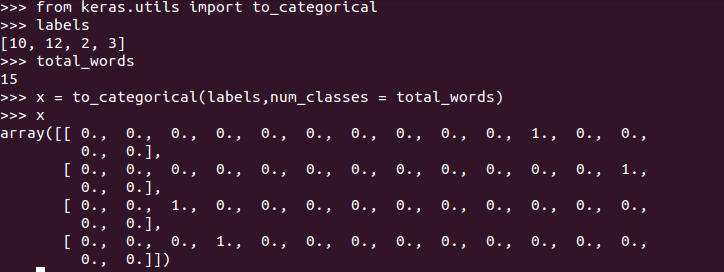

Week -04 :: Text Generation
-----------------------------

1) Generating text: Think of it as Prediction problem

2) Process
	Link for english songs: https://storage.googleapis.com/laurencemoroney-blog.appspot.com/irish-lyrics-eof.txt
	A) Take all corpus in one string, say english poems
	B) Split Corpus into sentences and all in lower case
	C) Fit tokenizer on it i.e. tokenizer.fit_on_texts
	D) create input sequences
		i) Pass each sentence via texts_to_sequences i.e. get list of indexes 
		ii) Create ngram out of it
		iii) do pad_sequences on ngram to make of equal length with padding = 'pre'

	E) Create Xs and Labels from input sequence. Say input sequence of length = 10,
	then Xs will be of 9 length and label will be last word index
	To create labels, use to_categorical from Keras which convert every label in to list of size total words and 1 at index of label value and rest will be 0. (one hot encoding of labels)

See code file (Copy of Course 3 - Week 4 - Lesson 1 - Notebook.ipynb OR copy_of_course_3_week_4_lesson_1_notebook.py)

3) Model Example

	model = Sequential()
	model.add(Embedding(total_words, 64, input_length=max_sequence_len-1))
	## here if use LSTM only, forward context only matters not backward. "big dog" makes sense but not "dog big".  
	model.add(Bidirectional(LSTM(20)))
	model.add(Dense(total_words, activation='softmax'))
	model.compile(loss='categorical_crossentropy', optimizer='adam', metrics=['accuracy'])
	history = model.fit(xs, ys, epochs=500, verbose=1)

Hyperparam Tune in above model like:
	A) Embedding dimension from 64 to 300..
	B) LSTM units
	C) Adam Learning rate like --> adam = Adam(lr = 0.1) and pass optimizer as adam not 'adam'
	D) different epochs

4) Disadvantage of above process is, it is going to hit memory error on large text. One way around is work on character prediction instead of word as no of unique chars is obviously too small than no of unique words. Data/Code resource: https://www.tensorflow.org/tutorials/text/text_generation 

5) Shakespeare Text: https://storage.googleapis.com/laurencemoroney-blog.appspot.com/sonnets.txt

See nlp_week4_exercise_shakespeare_answer.py

Model:
--------------

model = Sequential()
model.add(Embedding(total_words, 100, input_length=max_sequence_len-1))
model.add(Bidirectional(LSTM(150, return_sequences = True)))
model.add(Dropout(0.2))
model.add(LSTM(100))
model.add(Dense(total_words/2, activation='relu', kernel_regularizer=regularizers.l2(0.01)))
model.add(Dense(total_words, activation='softmax'))
model.compile(loss='categorical_crossentropy', optimizer='adam', metrics=['accuracy'])
print(model.summary())
